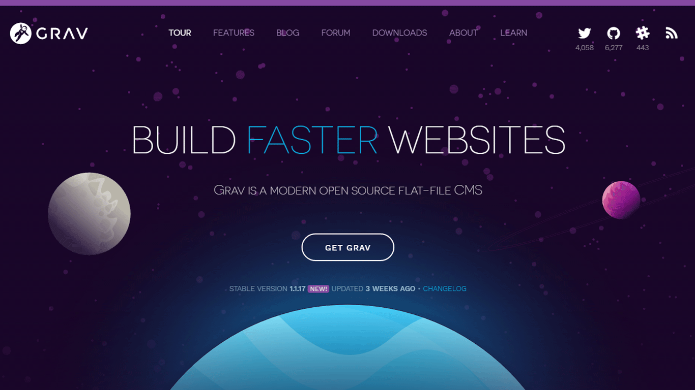

## GRAV - Modern open source flat-file CMS

### What is Grav ?

Grav is a Fast, Simple, and Flexible file-based Web-platform. There is Zero installation required. Just extract the ZIP archive, and you are already up and running. Although Grav follows principles similar to other flat-file CMS platforms, it has a different design philosophy than most.
— [Discover what Grav is all about and the core-concepts behind it](/learn-getgrav-org)

