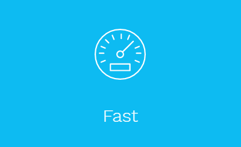
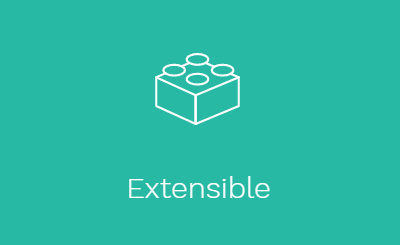
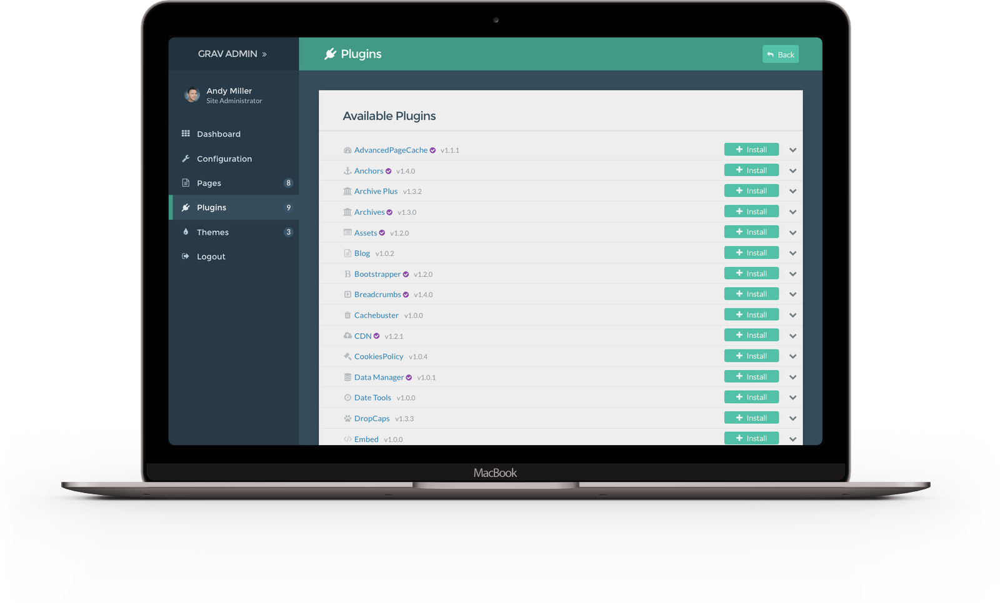
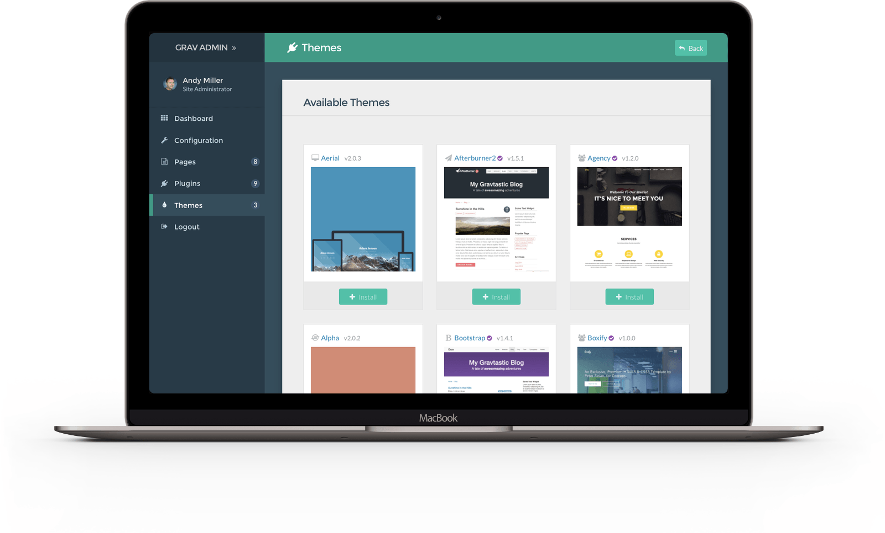

# GRAV - Modern open source flat-file CMS

  

    

      
    

    

      
TOUR

      

        <a>Friends</a>
      

      

        Matthew is an interior designer living in New York.
      

    

  

  
  

    

      
    

  

  

    

      
    

  

  

    

      
    

  

  

    

      
    

  

  

    

      
    

  

---

  

    

      
    

    

      
TOUR

      

        <a>Friends</a>
      

      

        Matthew is an interior designer living in New York.
      

    

    

      
        Joined in 2013
      
      
        <i class="user icon"></i>
        75 Friends
      
    

  

  
  

    

      
    

    

      
FEATURES

      

        Coworker
      

      

        Molly is a personal assistant living in Paris.
      

    

    

      
        Joined in 2011
      
      
        <i class="user icon"></i>
        35 Friends
      
    

  

  
  

    

      
    

    

      
BLOG

      

        <a>Coworker</a>
      

      

        Elyse is a copywriter working in New York.
      

    

    

      
        Joined in 2014
      
      
        <i class="user icon"></i>
        151 Friends
      
    

  

  

    

      
    

    

      
FORUM

      

        <a>Friends</a>
      

      

        Matthew is an interior designer living in New York.
      

    

    

      
        Joined in 2013
      
      
        <i class="user icon"></i>
        75 Friends
      
    

  

  
  

    

      
    

    

      
DOWNLOADS

      

        Coworker
      

      

        Molly is a personal assistant living in Paris.
      

    

    

      
        Joined in 2011
      
      
        <i class="user icon"></i>
        35 Friends
      
    

  

  
  

    

      
    

    

      
ABOUT

      

        <a>Coworker</a>
      

      

        Elyse is a copywriter working in New York.
      

    

    

      
        Joined in 2014
      
      
        <i class="user icon"></i>
        151 Friends
      
    

  

  
  

    

      
    

    

      
LEARN

      

        <a>Coworker</a>
      

      

        Elyse is a copywriter working in New York.
      

    

    

      
        Joined in 2014
      
      
        <i class="user icon"></i>
        151 Friends
      
    

  

  

  
---

  

    

      

        
      

      

        <a class="header" href="/grav/getgrav-org">Build Faster Websites</a>
      

    

  

  
  

    

      

        
      

      

        <a class="header">Grav Features</a>
      

    

  

  
  

    

      

        
      

      

        <a class="header">Developement Blog</a>
      

    

  

  
  

    

      

        
      

      

        <a class="header">Lorem ipsum</a>
      

    

  

  
  

    

      

        
      

      

        <a class="header">Lorem ipsum</a>
      

    

  

  
  

    

      

        
      

      

        <a class="header">Lorem ipsum</a>
      

    

  

  
  

    

      

        
      

      

        <a class="header">Lorem ipsum</a>
      

    

  

  

---

## BUILD FASTER WEBSITES
### Grav is a modern open source flat-file CMS

<a class="button button-outline button-fancy2" href="/downloads">Get Grav</a>

STABLE VERSION 1.1.17 NEW! UPDATED 3 WEEKS AGO • CHANGELOG

---

- [WHY GRAV](https://getgrav.org/#why_grav) 
- [EASY](https://getgrav.org/#easy) 
- [DEVELOPERS](https://getgrav.org/#developers) 
- [FEATURES](https://getgrav.org/#features) 
- [PROS](https://getgrav.org/#pros) 
- [COMMUNITY](https://getgrav.org/#community) 
- [LIMITLESS](https://getgrav.org/#limitless) 
- [BUILT](https://getgrav.org/#built)

---

## WHY CHOOSE GRAV?

- Grav is an award winning CMS platform
- Voted "Best Open Source CMS" in 2016

   
Performance is not just an afterthought, we baked it in from the start*

   
Grav has a powerful API and sophisticated Package Manager to make it super flexible

   
Grav is Open Source, and all the code is available on GitHub.com

---

## SUPER EASY TO USE

### The Grav admin plugin provides a simple and intuitive interface to make configuration and content creation easy and enjoyable.

<a href="/downloads/plugins" class="button button-solid button-fancy">
Get Admin Plugin
</a>

The Grav Admin dashboard provides a quick glance at your site state 

Easily modify Grav's flexible configuration settings with its advanced forms

Editing content is a breeze with Grav's powerful markdown editor

Changing your administrator information is quick and easy

Grav has a built in package manager with one-click install for plugins

You can also install a wide range of modern themes with one-click

{assets:css order:1}
//cdnjs.cloudflare.com/ajax/libs/semantic-ui/2.2.9/components/button.css
//cdnjs.cloudflare.com/ajax/libs/semantic-ui/2.2.9/components/card.css
//cdnjs.cloudflare.com/ajax/libs/semantic-ui/2.2.9/components/grid.css
{/assets}  
    
{assets:js order:1}
//cdnjs.cloudflare.com/ajax/libs/semantic-ui/2.2.9/semantic.js
{/assets}

{assets:inline_css order:2}
.abgc01 {background-color: #2A816D;}
.abgc02 {background-color: #439A86;}
.abgc11 {background-color: #055442;}
.abgc12 {background-color: #176D5A;}
.abgc13 {background-color: #2A816D;}
.abgc14 {background-color: #469785;}
.abgc15 {background-color: #73B7A8;}
{/assets}

