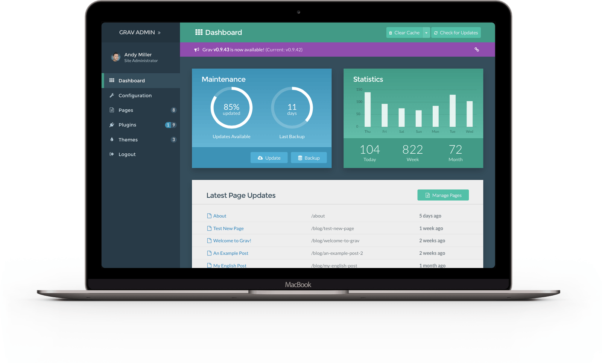
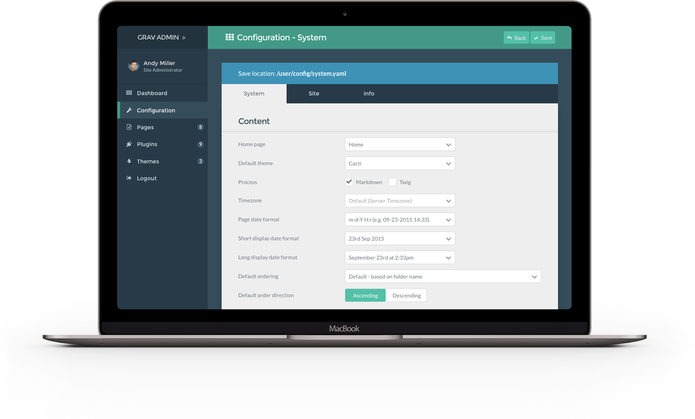
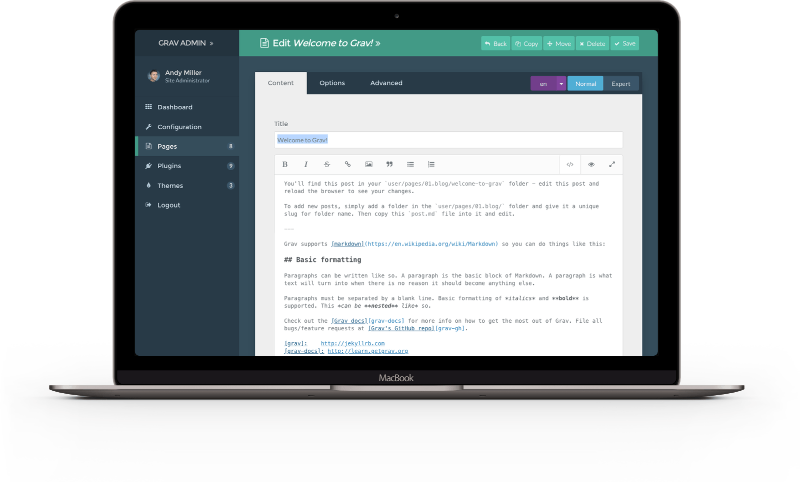

<button class="ui primary basic button">Primary</button>
<button class="ui secondary basic button">Secondary</button>
<button class="ui positive basic button">Positive</button>
<button class="ui negative basic button">Negative</button>

# GRAV - Modern open source flat-file CMS

- [TOUR](https://getgrav.org/) 
- [FEATURES](https://getgrav.org/features) 
- [BLOG](https://getgrav.org/blog) 
- [FORUM](https://getgrav.org/forum) 
- [DOWNLOADS](https://getgrav.org/downloads) 
- [ABOUT](https://getgrav.org/about) 
- [LEARN](http://learn.getgrav.org/)

---

## BUILD FASTER WEBSITES
### Grav is a modern open source flat-file CMS

<a class="button button-outline button-fancy2" href="/downloads">Get Grav</a>

STABLE VERSION 1.1.17 NEW! UPDATED 3 WEEKS AGO • CHANGELOG

---

- [WHY GRAV](https://getgrav.org/#why_grav) 
- [EASY](https://getgrav.org/#easy) 
- [DEVELOPERS](https://getgrav.org/#developers) 
- [FEATURES](https://getgrav.org/#features) 
- [PROS](https://getgrav.org/#pros) 
- [COMMUNITY](https://getgrav.org/#community) 
- [LIMITLESS](https://getgrav.org/#limitless) 
- [BUILT](https://getgrav.org/#built)

---

## WHY CHOOSE GRAV?

- Grav is an award winning CMS platform
- Voted "Best Open Source CMS" in 2016

   
Performance is not just an afterthought, we baked it in from the start*

   
Grav has a powerful API and sophisticated Package Manager to make it super flexible

   
Grav is Open Source, and all the code is available on GitHub.com

---

## SUPER EASY TO USE

### The Grav admin plugin provides a simple and intuitive interface to make configuration and content creation easy and enjoyable.

<a href="/downloads/plugins" class="button button-solid button-fancy">
Get Admin Plugin
</a>

The Grav Admin dashboard provides a quick glance at your site state 

Easily modify Grav's flexible configuration settings with its advanced forms

Editing content is a breeze with Grav's powerful markdown editor

Changing your administrator information is quick and easy

Grav has a built in package manager with one-click install for plugins

You can also install a wide range of modern themes with one-click

{assets:css order:1}
//cdnjs.cloudflare.com/ajax/libs/semantic-ui/2.2.9/components/button.css
{/assets}