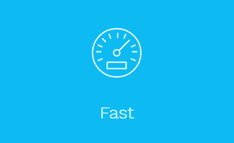
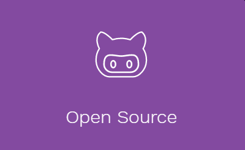

{assets:css order:1}
//cdnjs.cloudflare.com/ajax/libs/semantic-ui/2.2.9/components/button.css
{/assets}

Button
 A button indicates a possible user action
11 Themes  Download

New and Awesome Tool: See How Your Visitors are Really Using Your Site
ads via Carbon
Button

Types
Button
Emphasis
Animated
Labeled
Icon
Labeled Icon
Basic
Inverted
Groups
Content
States
Variations
Group Variations
Types

Button
A standard button

Follow
Although any tag can be used for a button, it will only be keyboard focusable if you use a <button> tag or you add the property tabindex="0". Keyboard accessible buttons will preserve focus styles after click, which may be visually jarring.
Button  Focusable
Emphasis
A button can be formatted to show different levels of emphasis

Setting your brand colors to primary and secondary color variables in site.variables will allow you to use your color theming for UI elements
Save   Discard
Okay   Cancel
Animated
A button can animate to show hidden content

The button will be automatically sized according to the visible content size. Make sure there is enough room for the hidden content to show
Next
 Shop
 
Sign-up for a Pro account
$12.99 a month
Labeled
A button can appear alongside a label

 Like
2,048
 
2,048
 Like
 
1,048
 Like
1,048
 Forks
1,048
Example

  

    <i class="heart icon"></i> Like
  

  <a class="ui basic red left pointing label">
    1,048
  </a>

  

    <i class="fork icon"></i> Forks
  

  <a class="ui basic left pointing blue label">
    1,048
  </a>

Icon
A button can have only an icon

Labeled Icon
A button can use an icon as a label

Pause   Next
Basic
A basic button is less pronounced

 Add Friend
 PrimarySecondaryPositiveNegativeExample
<button class="ui primary basic button">Primary</button>
<button class="ui secondary basic button">Secondary</button>
<button class="ui positive basic button">Positive</button>
<button class="ui negative basic button">Negative</button>

# GRAV - Modern open source flat-file CMS

- [TOUR](https://getgrav.org/) 
- [FEATURES](https://getgrav.org/features) 
- [BLOG](https://getgrav.org/blog) 
- [FORUM](https://getgrav.org/forum) 
- [DOWNLOADS](https://getgrav.org/downloads) 
- [ABOUT](https://getgrav.org/about) 
- [LEARN](http://learn.getgrav.org/)

---

## BUILD FASTER WEBSITES
### Grav is a modern open source flat-file CMS

<a class="button button-outline button-fancy2" href="/downloads">Get Grav</a>

STABLE VERSION 1.1.17 NEW! UPDATED 3 WEEKS AGO • CHANGELOG

---

- [WHY GRAV](https://getgrav.org/#why_grav) 
- [EASY](https://getgrav.org/#easy) 
- [DEVELOPERS](https://getgrav.org/#developers) 
- [FEATURES](https://getgrav.org/#features) 
- [PROS](https://getgrav.org/#pros) 
- [COMMUNITY](https://getgrav.org/#community) 
- [LIMITLESS](https://getgrav.org/#limitless) 
- [BUILT](https://getgrav.org/#built)

---

## WHY CHOOSE GRAV?

- Grav is an award winning CMS platform
- Voted "Best Open Source CMS" in 2016

   
Performance is not just an afterthought, we baked it in from the start*

   
Grav has a powerful API and sophisticated Package Manager to make it super flexible

   
Grav is Open Source, and all the code is available on GitHub.com

---

## SUPER EASY TO USE

### The Grav admin plugin provides a simple and intuitive interface to make configuration and content creation easy and enjoyable.

<a href="/downloads/plugins" class="button button-solid button-fancy">
Get Admin Plugin
</a>

The Grav Admin dashboard provides a quick glance at your site state 

Easily modify Grav's flexible configuration settings with its advanced forms

Editing content is a breeze with Grav's powerful markdown editor

Changing your administrator information is quick and easy

Grav has a built in package manager with one-click install for plugins

You can also install a wide range of modern themes with one-click

